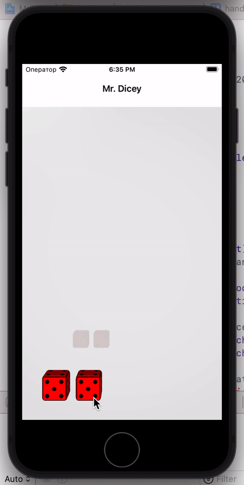
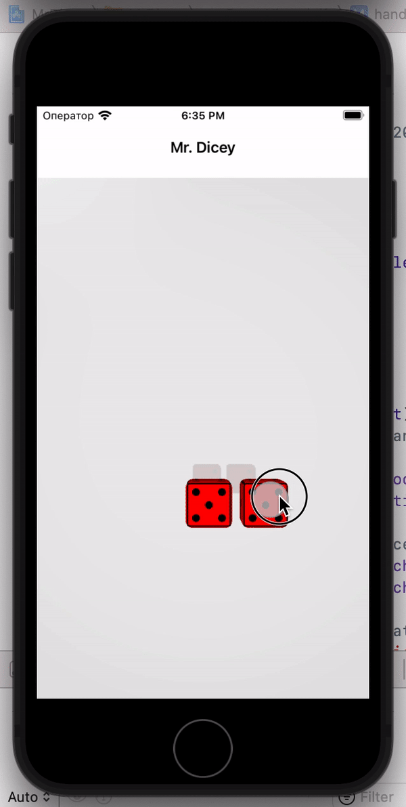

## Mr Dicey

### About

Part of a dice game interface called <b>Learn Craps Yo FREE</b>.  Thanks to [Mike Land](https://github.com/lando2319) for `SwiftUI` development contract.

<b>Date:</b> 2022-01-10

<b>Project Title:</b> Learn Craps Yo FREE

<b>Project Task:</b> Ultimately I want a new 3D version of the Dice on my current craps game to go into my New app Learn Craps Yo FREE.

#### Description

To create dice in 3D, I used `SceneKit`. In the scene I created models of cubes and floor, set up the physics of the scene and objects, camera, light. Then I added old textures from the first version of the game to the dice, rounded the edges a bit and I got dice with the necessary physics. 

To track the touch and hold of the dice, I used the `UIPanGestureRecognizer`, then added a movement and `applyForce` animation. In a real dice game, in order to make a valid roll, you need to throw the dice to one side of the table. I implemented this by throwing the dice to the right side of the screen. 

Another interesting nuance. The fact is that in professional dice the matrix of values is located in a certain way. Each front and opposite side of the cube will always be equal to the number 7. This is also implemented in this project that would save the reality of the dice game.

 

